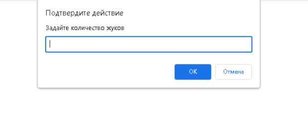
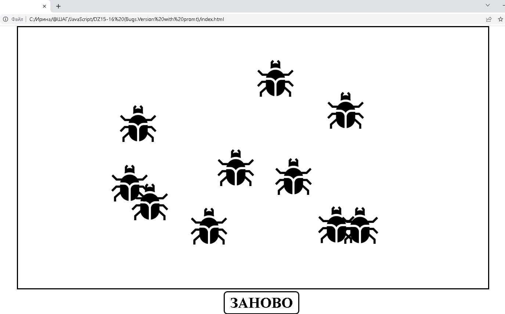
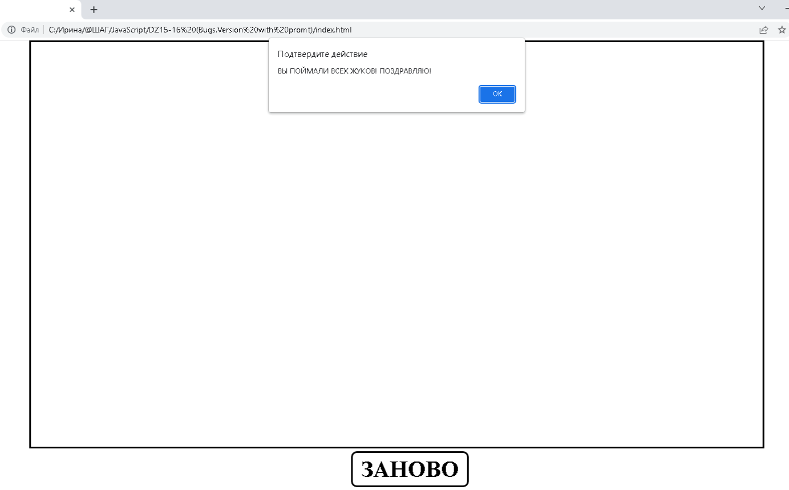

###Проект-игра "Catch the Bugs" ("Поймать жуков")
***
####Технологии:
- JavaScript
- HTML
- CSS
***
####Использование:
1. Запускаете файл index.html
2. В появившемся окне указываете желаемое количество жуков для игры:

3. Появляются жуки, которые раз в секунду меняют свои координаты. Задача игрока прихлопнуть их всех:

4. После уничтожения последнего жука появляется окно с поздравительной надписью:

5. Кнопка "ЗАНОВО" предназначена для запуска текущей игры сначала
6. Чтобы изменить количество жуков - обновите страницу
***
##УДАЧИ в ИГРЕ!
